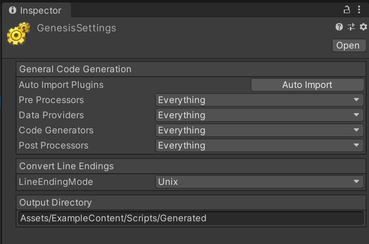
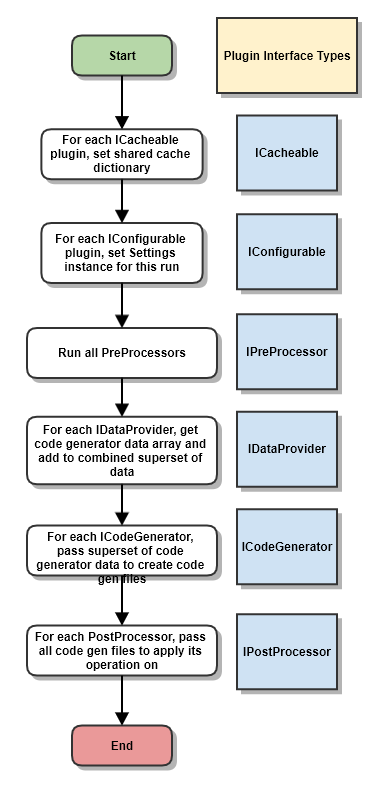

# Usage

I've broken down usage of Genesis into two roles:
* Users who want to use Genesis for code generation using existing plugins.
* Developers who want to add code-generation capabilities to their own games or libraries.

## For Users

As a user, leveraging Genesis is very easy. At a high level, it involves:
* Creating a `GenesisSettings` asset and configuring it.
* Using any of the pre-included Genesis plugin attributes to decorate your existing code where code generation is desired.
* Running code generation runner to create the desired script files.

### Configuring Code Generation

The first thing you will want to do is to create a `GenesisSettings` asset in the project. This will enable you to configure which plugins should generate code, where it should be output to, and other per-plugin settings. A Unity project can have a single or multiple `GenesisSettings` assets to generate different subsets of code. An example of how this can be useful might be using two different `GenesisSettings` instances with one for generating production code and another for generating fixtures for Unit Tests.



There are several default included plugin settings exposed here when importing and using Genesis.

#### General Code Generation

This section houses core project settings for Genesis to execute code generation.

* **Auto Import Plugins** This button enables a user to import all plugin settings into the `GenesisSettings` instance. This should typically be done when first creating a new `GenesisSettings` instance and when adding/creating new `IConfigurable` plugins.

Each of the mask fields below it enables confguring which plugins should be enabled on an individual basis when a code generation run takes place using this `GenesisSettings` instance. This can be useful for disabling undesired plugins or for troubleshooting how specific plugins behave.

For example, disabling the "Write Code Gen Files to Disk" `IPostProcessor` plugin enables running the code generation process without writing any of the generated `CodeGenFile` instances to disk.

#### Convert Line Endings

This allows a user to configure the line endings all code-generated files generated from this `GenesisSettings` instance. This can be useful where one line ending type is preferred over another or plugins create files with mixed line endings which often causes Unity to warn about in the console.

#### Output Directory

This allows a user to specify the root folder all code-generated files will be written to directly or in a subfolder to.

### Decorating Running Code Generation

Once you have a `GenesisSettings` asset created and configured, you can easily kick off a code-generation run by running the menu item "Tools/Genesis/Generate Code".

You'll notice at this point that there are likely not any generated files. Thats because Genesis plugins uses C# reflection to search through your code to find any classes decorated with custom attributes like `[FactoryKeyEnumFor]` as an example and generates code based on the discovered results.

## For Developers

Adding code generation capabilities to your game or library can help to:
* Automate creation of boilerplate, repetitive code files.
* Reduce creation of bugs from manually writing or copying and pasting repetitive scripts.
* Add to or extend APIs based on user code-base.

Genesis enables you to add code-generation to any game or library by offering:
* A multi-stage code-generation process with a fine degree of control
* Exposing several plugin types for integrating customized logic

### Code-Generation Process

The process for generating code in Genesis is pretty straightforward. Starting a code generation run or hotkey will walk through the following stages:



* **Setup** 
	* All plugin types are discovered via reflection and:
		* If they implement `ICacheable` are assigned a shared cache between all other `ICacheable` plugins
		* If they implement `IConfigurable` they are assigned the `GenesisSettings` instance for this run.
* **Code Generation**
	* All `IPreProcessor` plugins execute.
	* All `IDataProvider` plugins are executed and return a set of zero or more `CodeGeneratorData` instances. 
	* All `ICodeGenerator` plugins are passed the superset of `CodeGeneratorData` derives instances and return a set of zero or more `CodeGenFile` instances representing a code-generated file.
	* All `IPostProcessor` plugins are passed the superset of all `CodeGenFile` instances and execute their logic.

Where there are multiple `GenesisSettings` instances, a code generation run will be executed for the steps listed above in sequence of when they were discovered. During that time Unity's compilation and AssetDatabase will be locked until either all code generation runs have completed or an error occurs, at which point both will be unlocked.

### Plugin Types
Genesis is a tool that enables developers to easily add code-generation capabilities to their ganes, libraries with ease. It does this by exposing several plugin types and configuration types via the `Genesis.Editor` AssemblyDefinition that allow for hooking into the code-generation at different points in the process.

* **ICacheable**: While not a plugin interface itself, if implemented on a `IDataProvider`, `ICodeGenerator` or `IPostProcessor` plugin it will pass a shared cache to be set prior to the code-generation process beginning on all implementing types.

```csharp
	/// <summary>
	/// Indicates that the object should be given access to a object cache shared 
	/// between multiple plugins (NOT THREAD SAFE).
	/// </summary>
	public interface ICacheable
	{
		Dictionary<string, object> ObjectCache { get; set; }
	}
```

* **IConfigurable**: While not a plugin interface itself, all plugin interfaces that implement this will be configured with the `GenesisSettings` instance for this run prior to the code generation process beginning. This can be useful for using project settings configured by a user in one or more plugins.

```csharp
/// <summary>
	/// Indicates that an object can be configured based on project settings in
	/// <see cref="GenesisSettings"/>.
	/// </summary>
	public interface IConfigurable
	{
		/// <summary>
		/// Configures preferences
		/// </summary>
		/// <param name="settings"></param>
		void Configure(GenesisSettings settings);
	}
```

* **ICodeGenerationPlugin**: All other interface types, with exception to `ICacheable` and `IConfigurable` derive from this internal interface. This allows for defining the plugin's display name as seen by a user during code generation, the priority this plugin should run with regards to others of the same interface type (ordered from lowest to highest), and whether or not this plugin should execute as part of a _Dry Run_ (essentially a test run before actually generating code).

```csharp
	/// <summary>
	/// Represent an object that offers some measure of code generation plugin functionality.
	/// </summary>
	public interface ICodeGenerationPlugin
	{
		/// <summary>
		/// The name of the plugin.
		/// </summary>
		string Name { get; }

		/// <summary>
		/// The priority value this plugin should be given to execute with regards to other plugins,
		/// ordered by ASC value.
		/// </summary>
		int Priority { get; }

		/// <summary>
		/// Returns true if this plugin should be executed in Dry Run Mode, otherwise false.
		/// </summary>
		bool RunInDryMode { get; }
	}
```

* **IPreProcessor**: This plugin type allows for logic to be executed prior to any code generation. Good usages of this type include any asset staging, validation, fixes, etc..

```csharp
	/// <summary>
	/// Represents a plugin that executes a processing action before all other plugin types.
	/// These are commonly used for validation prior to generating code.
	/// </summary>
	public interface IPreProcessor : ICodeGenerationPlugin
	{
		/// <summary>
		/// Executes a pre-processing action.
		/// </summary>
		void PreProcess();
	}
```

* **IDataProvider**: This plugin type is used to execute logic searching for and creating `CodeGeneratorData` instances used as the basis upon which to generate code in `ICodeGenerator` instances. `CodeGeneratorData` itself is simply an abstract dictionary allowing you to assign arbitrary data to a `string` key. Typically these might be populated using reflection to search for desired types and setting various bits of key information per type into an instance of `CodeGeneratorData`, but you could also infer what to generate code from based on whatever you want.

Genesis's architecture encourages using one `IDataProvider` for each unique type or category that would cause code to be generated and returns an array of `CodeGeneratorData` derived instances for all discovered instances. This contrasts with `ICodeGenerator`, where you may have more then one plugin that generates different types of script files based on the same set of `CodeGeneratorData`. This implies the relationship of `IDataProvider` to `ICodeGenerator` for the same type of data to be _One to Zero or More_.

For a practical example of this, please look at the included `ScriptableFactoryDataProvider` and `ScriptableFactoryCodeGenerator` types for how these responsibilies are broken out between "A plugin that provides data" and "A plugin that generates code based on that provided data".

```csharp
	/// <summary>
	/// Represents a plugin that executes before code generation to provides data for
	/// <see cref="ICodeGenerationPlugin"/> instances.
	/// </summary>
	public interface IDataProvider : ICodeGenerationPlugin
	{
		/// <summary>
		/// Creates zero or more <see cref="CodeGeneratorData"/> derived instances 
		/// for code generation to execute upon.
		/// </summary>
		/// <returns></returns>
		CodeGeneratorData[] GetData();
	}
```

* **ICodeGenerator**: This plugin type is used to execute the logic generating `CodeGenFile` instances based on the passed superset of all `CodeGenerationData` instances. Typically this involves filtering that superset to the subset of instances specific to your plugin. 

For example, the `ScriptableFactoryCodeGenerator` filters that collection for all `CodeGenerationData` derived instances where the type of data is a `FactoryKeyEnumData`. This allows this custom code generator plugin to generate its code files off of that specific type of code gen data.

How a `CodeGenFile` is created is largely up to you. `ScriptableFactoryCodeGenerator` uses token substituion over string formatting because I believe its easier to read and understand the template code file that way, but in short its up to you to decide how you want to constitute the parts of the code file set into a `CodeGenFile` instance.


```csharp
	/// <summary>
	/// Represents an object that can generate zero or more <see cref="CodeGenFile"/> 
	/// instances based on a subset of <see cref="CodeGeneratorData"/> instances.
	/// </summary>
	public interface ICodeGenerator : ICodeGenerationPlugin
	{
		CodeGenFile[] Generate(CodeGeneratorData[] data);
	}
```

* **IPostProcessor**: This plugin type executes logic after all `ICodeGenerator` plugins have executed and is passed the superset of all `CodeGenFile` instances to apply its logic to and return back. This can be useful where there are desired operations to filter or apply logic to all code generated files.

Practical examples of using this plugin type in this project include logging the results of code generation to the console, converting line endings to the desired format for consistency, writing the `CodeGenFile` instances to disk, etc...


```csharp
	/// <summary>
	/// Represents a plugin which performs a post-processing action on a code-generated file.
	/// </summary>
	public interface IPostProcessor : ICodeGenerationPlugin
	{
		/// <summary>
		/// Returns a set of code generated files that have had a processing action 
		/// performed on them.
		/// </summary>
		/// <param name="files"></param>
		/// <returns></returns>
		CodeGenFile[] PostProcess(CodeGenFile[] files);
	}
```

### Adding new settings to `GenesisSettings`

The `GenesisSettings` asset itself is a simple list of KeyValuePairs of strings much like a properties or config file. Additional settings can be added to it by developers by implementing the `IConfigurable` interface while additional inspector UI can drawn to expose custom properties by creating an `ISettingsDrawer` implemented type.

```csharp
	/// <summary>
	/// Represents methods for an EditorGUI Drawer for a set of properties on a 
	/// <see cref="GenesisSettings"/> instance. Enables custom drawing of zero or 
	/// more settings that will appear on the <see cref="GenesisSettings"/> inspector.
	/// </summary>
	public interface ISettingsDrawer
	{
		/// <summary>
		/// The display title for this drawer
		/// </summary>
		string Title { get; }

		/// <summary>
		/// Initializes any setup for the drawer prior to rendering any GUI.
		/// </summary>
		/// <param name="settings"></param>
		void Initialize(GenesisSettings settings);

		/// <summary>
		/// Draws the header GUI section
		/// </summary>
		/// <param name="settings"></param>
		void DrawHeader(GenesisSettings settings);

		/// <summary>
		/// Draws the body GUI section
		/// </summary>
		/// <param name="settings"></param>
		void DrawContent(GenesisSettings settings);
	}

```
